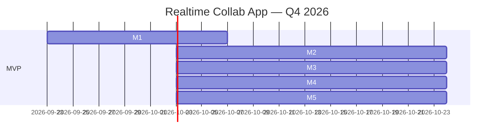
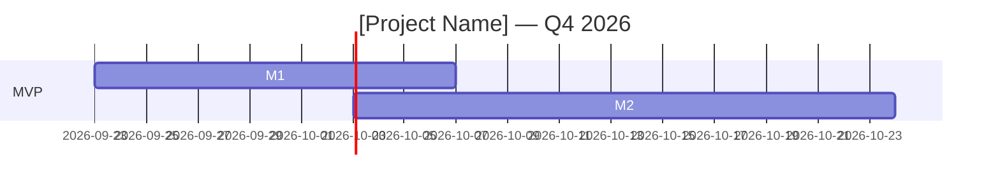

# Product Roadmap & Prioritization Guide

**Purpose:** Visualize product roadmap, prioritize features systematically, and communicate timelines to stakeholders.

**When to use:** Medium+ projects with multiple features, or when stakeholders ask "what's next?"

---

## Roadmap Types

| Type | Timeframe | Granularity | Audience |
|------|-----------|-------------|----------|
| **Now-Next-Later** | Rolling | Feature themes | Executives, non-technical stakeholders |
| **Quarterly** | 3-6 months | Epics + features | Product team, engineering |
| **Sprint/Milestone** | 2-4 weeks | User stories + tasks | Engineering team |
| **Release** | Per version | Features + bug fixes | Users, support team |

---

## Now-Next-Later Roadmap (Simple)

**Format:** 3 columns, no dates

**Commitment-level rule — state this explicitly wherever the roadmap is shared, not just internally:**

| Column | Commitment level | May carry | Must NOT carry |
|---|---|---|---|
| **NOW** | Committed | The current sprint/milestone's own dates (already scoped, already estimated) | — |
| **NEXT** | Directional, not committed | A quarter or milestone-count estimate at most ("next 1-2 milestones") | A specific date, week, or "by [month]" promise |
| **LATER** | Backlog, unordered | Nothing date-shaped at all | Any date, quarter, or ordering implying sequence |

The most common roadmap failure this guide exists to prevent is not
missing a column — it's a stakeholder mentally converting "Next" into
a committed date because it was presented next to items that *do* have
dates. When sharing a Now-Next-Later roadmap externally or with
non-technical stakeholders, add one explicit line restating this rule
in plain language, e.g.: *"Now is what we're shipping this sprint.
Next is what we expect to start on after that — not a promised date.
Later is unordered backlog with no timeline commitment."* Do not let a
verbal "probably by end of quarter" attach itself to a Next-column item
without that caveat repeated alongside it; if a real date commitment is
needed for a Next item, move it to Now once it's actually scoped, or
communicate it as a separate, explicitly-dated commitment outside the
roadmap document.

```markdown
# Product Roadmap — Realtime Collab App

## NOW (Current sprint/milestone)
- ✅ User authentication (OAuth + Email)
- ✅ Real-time cursor tracking
- 🚧 Whiteboard canvas (Fabric.js integration)
- 🚧 Basic shapes (rectangle, circle, line)

## NEXT (Next 1-2 milestones)
- Image upload & embed
- Text annotations
- Export to PNG/SVG
- Undo/redo history

## LATER (Backlog, no commitment)
- Video chat integration
- Mobile app (React Native)
- AI auto-layout
- Templates library

## NOT DOING (Explicitly out of scope)
- Real-time video editing
- File storage (use external CDN)
- Native desktop app (PWA sufficient)
```

**Pros:** Simple, no false precision, easy to update  
**Cons:** No timeline, hard to plan resources

---

## Quarterly Roadmap (Gantt-style)

**Format:** Timeline with milestones

```markdown
# Q4 2026 Roadmap — Realtime Collab App

## Timeline

| Milestone | Start | End | Status |
|-----------|-------|-----|--------|
| **M1: Auth & Realtime** | 2026-09-23 | 2026-10-06 | 🚧 In Progress |
| **M2: Whiteboard Core** | 2026-10-07 | 2026-10-27 | ⏳ Planned |
| **M3: Collab Features** | 2026-10-28 | 2026-11-17 | ⏳ Planned |
| **M4: Export & Share** | 2026-11-18 | 2026-12-08 | ⏳ Planned |
| **M5: Polish & Launch** | 2026-12-09 | 2026-12-29 | ⏳ Planned |

## Feature Breakdown

### M1: Auth & Realtime (2 weeks)
- User authentication (OAuth: GitHub, Google)
- Email + password (SMTP via Resend)
- Anonymous guest access
- Real-time cursor tracking (Supabase Realtime)
- Presence indicators (online/offline)

### M2: Whiteboard Core (3 weeks)
- Canvas rendering (Fabric.js)
- Basic shapes (rectangle, circle, line, arrow)
- Freehand drawing (pen tool)
- Color picker + stroke width
- Pan & zoom

### M3: Collab Features (3 weeks)
- Real-time shape sync (operational transform)
- User avatars & names on cursors
- Text annotations
- Image upload & embed
- Layer management (z-index)

### M4: Export & Share (3 weeks)
- Export to PNG/SVG
- Share link (public/private)
- Undo/redo history (command pattern)
- Keyboard shortcuts

### M5: Polish & Launch (3 weeks)
- Performance optimization (canvas rendering)
- Accessibility (keyboard nav, screen reader)
- Onboarding tutorial (first-time user)
- Landing page + docs
- Production deploy

## Dependencies

- M2 depends on M1 (need auth before saving boards)
- M3 depends on M2 (need canvas before collab)
- M4 depends on M3 (need collab before export)
- M5 depends on M4 (need all features before launch)

## Risks

| Risk | Probability | Impact | Mitigation |
|------|-------------|--------|------------|
| **Operational transform too complex** | Medium | High | Use CRDT library (Yjs) instead of custom OT |
| **Fabric.js performance on mobile** | High | Medium | Defer mobile optimization to post-launch |
| **Scope creep ([contributor] adds features)** | High | Medium | Lock scope after M2, new features go to Phase 2 |
```

**Pros:** Clear timeline, resource planning possible, dependencies visible  
**Cons:** Requires upfront estimation, dates may slip

---

## Gantt Chart Visualization

**Tool options:**

1. **Markdown table** (simple, version-controlled)
2. **Mermaid.js Gantt** (renders in GitHub/GitLab)
3. **Google Sheets** (free, collaborative)
4. **Notion timeline** (visual, drag-and-drop)
5. **Jira roadmap** (integrated with tickets)
6. **Linear roadmap** (automatic from milestones)

**Mermaid.js example:**



(Paste into `docs/ROADMAP.md` — renders automatically on GitHub)

---

## Prioritization Frameworks

### 1. RICE Scoring (Data-Driven)

**Formula:**
```
RICE = (Reach × Impact × Confidence) / Effort

Reach: Users affected per quarter (number)
Impact: 3=Massive, 2=High, 1=Medium, 0.5=Low, 0.25=Minimal
Confidence: 100%=High, 80%=Medium, 50%=Low
Effort: Person-months (number)
```

**Spreadsheet template:**

| Feature | Reach | Impact | Confidence | Effort | RICE | Priority |
|---------|-------|--------|------------|--------|------|----------|
| User auth | 1000 | 3 | 100% | 2 | **1500** | P0 (Must-have) |
| Whiteboard canvas | 1000 | 3 | 100% | 3 | **1000** | P0 |
| Real-time collab | 1000 | 3 | 80% | 4 | **600** | P0 |
| Export PNG | 800 | 2 | 100% | 1 | **1600** | P1 (Should-have) |
| Image upload | 600 | 2 | 100% | 1.5 | **800** | P1 |
| Undo/redo | 1000 | 1 | 80% | 2 | **400** | P1 |
| Dark mode | 500 | 1 | 100% | 0.5 | **1000** | P2 (Nice-to-have) |
| Video chat | 300 | 2 | 50% | 6 | **50** | P3 (Defer) |
| Mobile app | 400 | 2 | 50% | 8 | **50** | P3 |

**How to use:**
1. Score all features
2. Sort by RICE (descending)
3. Draw line at resource capacity (e.g., top 10 features = Q4 scope)
4. Everything below line = backlog

**Best for:** Product managers with user data (analytics, surveys)

---

### 2. WSJF (Weighted Shortest Job First)

**Formula:**
```
WSJF = Cost of Delay / Job Duration

Cost of Delay = User Value + Time Criticality + Risk Reduction
(Each scored 1-10)

Job Duration = Effort in weeks
```

**Example:**

| Feature | User Value | Time Crit | Risk Red | CoD | Duration | WSJF | Priority |
|---------|------------|-----------|----------|-----|----------|------|----------|
| Security patch | 8 | 10 | 10 | 28 | 1 | **28.0** | P0 |
| Payment integration | 10 | 8 | 5 | 23 | 4 | **5.75** | P1 |
| Search | 6 | 3 | 2 | 11 | 3 | **3.67** | P2 |
| Dark mode | 4 | 2 | 1 | 7 | 2 | **3.5** | P2 |
| Analytics dashboard | 5 | 4 | 3 | 12 | 6 | **2.0** | P3 |

**Best for:** SAFe/agile teams, time-sensitive projects

---

### 3. Value vs. Effort Matrix (Visual)

**2×2 Matrix:**

```
         High Value
            |
   Quick   |   Big Bets
   Wins    |   (Do 2nd)
   (Do 1st)|   
-----------|------------
   Fill-ins|   Money Pit
   (Do 3rd)|   (Avoid)
            |
         Low Value
```

**Mapping features:**

- **Quick Wins** (High Value, Low Effort): Export PNG, dark mode, keyboard shortcuts → Do first
- **Big Bets** (High Value, High Effort): Real-time collab, whiteboard canvas → Do second (after quick wins)
- **Fill-ins** (Low Value, Low Effort): Polish animations, easter eggs → Do if time left
- **Money Pit** (Low Value, High Effort): Video chat, mobile app → Defer to Phase 2

**Best for:** Stakeholder communication (non-technical audience understands visual)

---

### 4. MoSCoW (Simple Bucketing)

**Categories:**

- **Must-have (M):** Mandatory for launch (MVP)
- **Should-have (S):** Important but not blocking launch
- **Could-have (C):** Nice-to-have if time permits
- **Won't-have (W):** Explicitly deferred to later phase

**Example:**

**Must-have (M):**
- User auth (OAuth + Email)
- Whiteboard canvas (basic shapes)
- Real-time cursor tracking
- Save/load boards

**Should-have (S):**
- Export PNG/SVG
- Undo/redo
- Image upload
- Share link

**Could-have (C):**
- Dark mode
- Templates library
- Keyboard shortcuts guide

**Won't-have (W):**
- Video chat
- Mobile app
- AI features

**Best for:** Fast prioritization, non-technical stakeholders

---

## Roadmap Communication

### Internal (Engineering Team)

**Format:** Detailed milestone breakdown with tasks

**Tool:** Linear / Jira / GitHub Projects

**Update cadence:** Daily (via standup)

**Example message:**
> "M1 (Auth & Realtime) is 60% done. OAuth integration complete, email auth blocked on SMTP config ([contributor] needs to provide Resend API key). ETA: 2026-10-06 (on track)."

---

### External (Stakeholders / Clients)

**Format:** High-level themes, avoid technical jargon

**Tool:** Email update / Notion page / Loom video

**Update cadence:** Weekly or per milestone

**Example message:**
> "Week 1 update: User login is working (you can sign in with GitHub/Google). Next week: whiteboard drawing tools. Launch still on track for December."

---

### Public (Users)

**Format:** Now-Next-Later or changelog

**Tool:** Public roadmap page (Canny, ProductBoard, simple HTML page)

**Update cadence:** Monthly or per release

**Example:**
> **What's New (September 2026)**
> - ✅ Real-time collaboration (see others' cursors)
> - ✅ Export to PNG
> 
> **Coming Soon (October 2026)**
> - Image upload
> - Undo/redo
> - Dark mode
> 
> **Vote on features:** [link to feedback board]

---

## Roadmap Anti-Patterns

❌ **Date promises without estimates** — "We'll ship video chat in November" (no estimation done)  
❌ **Overcommitment** — Roadmap has 50 features for Q4 (team is 2 people)  
❌ **No prioritization** — Everything is P0 (if everything is urgent, nothing is)  
❌ **Ignoring dependencies** — M3 scheduled before M2 done  
❌ **Stale roadmap** — Last updated 6 months ago  
❌ **No buffer** — Every week packed, no slack for bugs/learning  
❌ **Feature creep** — New features added mid-sprint without removing others  

---

## Integration with Project Lifecycle

**Update `modules/02a-planning-core-phases.md` Phase 1:**

```markdown
### Q1e — Product Roadmap

> "What's the high-level roadmap for the next 3-6 months?"

**Options:**
- **Now-Next-Later** (simple, no dates, easy to update)
- **Quarterly Gantt** (timeline with milestones + dependencies)
- **Release-based** (v1.0, v1.1, v2.0)
- **Theme-based** (Q4 = Collaboration, Q1 = Performance)

**Sub-questions:**
- Q1e-i: Prioritization framework? (RICE / WSJF / Value-Effort / MoSCoW)
- Q1e-ii: Update cadence? (Weekly / Per milestone / Monthly)
- Q1e-iii: Public roadmap? (Yes: Canny / ProductBoard / Simple page | No: Internal only)

**Output file:** `docs/ROADMAP.md` (Mermaid Gantt or Now-Next-Later)

**Mandatory for:** Medium+ projects, client-facing projects, open-source projects

**Skip for:** Solo experiments (Small tier), internal tools with 1 user
```

**Update `engine/GATE-REGISTRY.md`:**

```markdown
### gate:planning-complete (Planning Phase Done)

**Evidence:**
- PRD signed
- FSD signed
- Architecture decided (ADR)
- Roadmap published (`docs/ROADMAP.md`) ← UPDATED
- First sprint/milestone planned
- RACI matrix + conflict resolution defined

**Blocker:** Cannot start build without clear roadmap (what to build first?).
```

---

## Roadmap Tooling & Automation

**Manual roadmap maintenance is error-prone.** Use tools that integrate with your project management workflow.

### Roadmap Tools by Tier

| Tier | Tool | Price | Integration | Best For |
|------|------|-------|-------------|----------|
| **Small** | Markdown file (`docs/ROADMAP.md`) | Free | GitHub/GitLab | Solo dev, simple roadmap |
| **Medium** | Linear Roadmap | Free (included) | Linear Issues | Teams using Linear |
| **Medium** | GitHub Projects | Free | GitHub Issues | Teams using GitHub |
| **Large** | ProductBoard | $20-60/user/mo | Jira, Slack, Intercom | Product-led teams, customer feedback |
| **Large** | Aha! | $59-149/user/mo | Jira, Azure DevOps | Enterprise roadmap + strategy |
| **Enterprise** | Jira Product Discovery | $10/user/mo | Jira, Confluence | Large teams, complex dependencies |

### Linear Roadmap (Recommended for Medium)

**Setup:**

1. Create milestones (Linear → Settings → Milestones)
   - M1: Auth & Realtime (2026-09-23 - 2026-10-06)
   - M2: Whiteboard Core (2026-10-07 - 2026-10-27)
   - M3: Collab Features (2026-10-28 - 2026-11-17)

2. Assign issues to milestones
   - Issue: "User authentication (OAuth)" → Milestone: M1
   - Issue: "Canvas rendering (Fabric.js)" → Milestone: M2

3. View roadmap (Linear → Roadmap tab)
   - Automatic Gantt chart from milestones
   - Drag-and-drop to adjust dates
   - Color-coded by project/team

**Public roadmap:**

Linear → Settings → Public Roadmap → Enable
- Share link: `https://linear.app/company/roadmap`
- Viewers see milestones + issues (no comments/internal notes)

**Automation:**

```typescript
// Sync Linear roadmap to Notion (via Linear API)
import { LinearClient } from '@linear/sdk'

const linear = new LinearClient({ apiKey: process.env.LINEAR_API_KEY })

const milestones = await linear.projectMilestones({
  filter: { project: { id: { eq: 'PROJECT_ID' } } }
})

for (const milestone of milestones.nodes) {
  console.log(`${milestone.name}: ${milestone.targetDate}`)
  // Sync to Notion database
  await notion.pages.create({
    parent: { database_id: 'ROADMAP_DB_ID' },
    properties: {
      Name: { title: [{ text: { content: milestone.name } }] },
      TargetDate: { date: { start: milestone.targetDate } }
    }
  })
}
```

### GitHub Projects (Roadmap View)

**Setup:**

1. Create project (GitHub → Projects → New Project → Roadmap template)
2. Add issues/PRs to project
3. Set start/end dates on each issue
4. View roadmap (automatic timeline visualization)

**Automation (GitHub Actions):**

```yaml
# .github/workflows/roadmap-update.yml
name: Update Roadmap
on:
  issues:
    types: [closed]

jobs:
  update:
    runs-on: ubuntu-latest
    steps:
      - uses: actions/github-script@v7
        with:
          script: |
            // Move closed issues to "Done" column
            const project = await github.rest.projects.getColumn({
              column_id: 12345  // "Done" column ID
            })
            await github.rest.projects.moveCard({
              card_id: context.payload.issue.id,
              position: 'top',
              column_id: 12345
            })
```

### ProductBoard (Customer-Driven Roadmap)

**Features:**
- Customer feedback integration (Intercom, Zendesk, Slack)
- Feature voting (users vote on roadmap items)
- Impact scoring (user requests × revenue)
- Release timeline (automatic from planned features)

**Use case:** B2B SaaS where customer requests drive roadmap.

**Setup:**

1. Import features from Jira/Linear
2. Connect feedback sources (Intercom, Zendesk)
3. Score features (RICE framework built-in)
4. Publish public roadmap (iframe embed or standalone page)

**Price:** $20/month (Essentials) → $60/month (Pro)

### Canny (Public Roadmap + Voting)

**Features:**
- Public roadmap page (`roadmap.yourcompany.com`)
- Feature voting (users upvote requests)
- Changelog (auto-generated from completed items)
- Integrations (Jira, Linear, Slack, Intercom)

**Use case:** Public-facing products where users vote on features.

**Price:** $50/month (Starter) → $200/month (Growth)

**Example:** Linear's public roadmap uses Canny

---

## Templates

### Template 1: Now-Next-Later (Markdown)

```markdown
# Product Roadmap — [Project Name]

**Last updated:** 2026-09-22  
**Maintained by:** [Product Owner]

## NOW (Current sprint/milestone)
- Feature A (in progress)
- Feature B (in progress)

## NEXT (Next 1-2 milestones)
- Feature C
- Feature D
- Feature E

## LATER (Backlog, no commitment)
- Feature F
- Feature G

## NOT DOING (Explicitly out of scope)
- Feature X (reason: low value)
- Feature Y (reason: too complex)
```

---

### Template 2: Quarterly Roadmap (Gantt)

```markdown
# Q4 2026 Roadmap — [Project Name]

## Timeline

| Milestone | Start | End | Status |
|-----------|-------|-----|--------|
| M1: [Name] | YYYY-MM-DD | YYYY-MM-DD | 🚧 / ⏳ / ✅ |
| M2: [Name] | YYYY-MM-DD | YYYY-MM-DD | ⏳ |

## Gantt Chart



## Feature Breakdown

### M1: [Name] (X weeks)
- Feature A
- Feature B

### M2: [Name] (X weeks)
- Feature C
- Feature D

## Dependencies

- M2 depends on M1 (reason)

## Risks

| Risk | Probability | Impact | Mitigation |
|------|-------------|--------|------------|
| [Risk] | High/Med/Low | High/Med/Low | [Action] |
```

---

### Template 3: RICE Scoring (CSV)

```csv
Feature,Reach,Impact,Confidence,Effort,RICE,Priority
User auth,1000,3,100%,2,1500,P0
Whiteboard,1000,3,100%,3,1000,P0
Export PNG,800,2,100%,1,1600,P1
Dark mode,500,1,100%,0.5,1000,P2
```

(Import into Google Sheets, sort by RICE descending)

---

**Agent instruction:**

When stakeholder asks "what's next?" or "when will X be ready?":

1. Check if `docs/ROADMAP.md` exists
2. If not: ask user Q1e (roadmap format + prioritization framework)
3. Generate roadmap from milestones + PRD features
4. Use prioritization framework to rank features (RICE recommended for data-driven, MoSCoW for simple)
5. Visualize with Mermaid Gantt (if timeline roadmap) or Now-Next-Later (if rolling roadmap)
6. Update roadmap when milestone completes or priorities change
7. Communicate roadmap changes to stakeholders (weekly update or per milestone)

Do not promise dates without effort estimation. Do not add features to current sprint without removing others (fixed time box).
